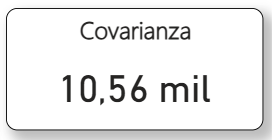

# 🛒 Retail Sales & Correlation Analysis — Power BI

> Proyecto de análisis de ventas retail con aplicación de **estadística inferencial** (Covarianza y Coeficiente de Pearson) implementada manualmente en DAX dentro de Power BI Desktop.

---

##  Herramienta utilizada: Microsoft Power BI

Power BI es la plataforma líder de Business Intelligence de Microsoft, utilizada por empresas de todo el mundo para transformar datos en reportes interactivos y toma de decisiones basada en evidencia. Este proyecto va más allá del uso convencional de la herramienta al incorporar **medidas estadísticas construidas desde cero en DAX**, lo que demuestra un dominio avanzado de la plataforma.

**¿Por qué Power BI para este proyecto?**
- Permite combinar visualizaciones de negocio con cálculos estadísticos personalizados en un mismo entorno
- El lenguaje **DAX** soporta fórmulas iterativas (`SUMX`, `AVERAGEX`) que hacen posible implementar estadística sin herramientas externas
- Los gráficos de dispersión (`Scatter Chart`) son ideales para visualizar relaciones entre variables cuantitativas
- La interactividad de los filtros permite explorar cómo cambia la correlación según segmento, categoría o tienda

---

##  Objetivo del Proyecto

Construir un reporte analítico de ventas retail que no solo muestre el desempeño comercial, sino que responda una pregunta estadística de fondo:

> **¿Existe una relación entre la cantidad de unidades vendidas y el total de ventas generado? ¿Qué tan fuerte es esa relación?**

Para responderla se implementaron dos métricas estadísticas clásicas directamente en DAX: la **Covarianza** y el **Coeficiente de Correlación de Pearson**, construidas manualmente fórmula a fórmula.

---

##  Estructura del Reporte

El archivo `.pbix` contiene **3 páginas** con un flujo narrativo claro: portada → análisis comercial → análisis estadístico.

---

### Página 1 — `Presentacion` (Portada)
Página de entrada con diseño visual profesional y botón de navegación hacia el dashboard principal. Establece el contexto del proyecto desde el primer vistazo.

> 📸 **[FOTO: Pantalla de portada del reporte]**
>
> *Cómo agregarla: Abre el archivo en Power BI Desktop → ve a la página "Presentacion" → toma un screenshot → guárdalo como `portada.png` en la carpeta `/assets/` de tu repositorio → reemplaza esta línea con:*
> ```markdown
> 
> ```

---

### Página 2 — `Transacciones Comerciales - Retail` (Dashboard principal)
Dashboard completo de desempeño comercial con múltiples dimensiones de análisis. Responde las preguntas operativas del negocio: ¿dónde se vende más?, ¿cómo pagan los clientes?, ¿qué categorías lideran?

> 📸 **[FOTO: Vista completa del dashboard de Transacciones Comerciales]**
>
> *Cómo agregarla: Ve a la página "Transacciones Comerciales - Retail" → captura el dashboard completo → guarda como `dashboard_transacciones.png` en `/assets/` → usa:*
> ```markdown
> 
> ```

---

### Página 3 — `Análisis de Correlación` ⭐ (Página estrella)
La página más técnica y diferenciadora del proyecto. Combina un gráfico de dispersión con métricas estadísticas calculadas en DAX para determinar la naturaleza y fuerza de la relación entre cantidad vendida y ventas totales.

> 📸 **[FOTO: Vista completa de la página de Análisis de Correlación]**
>
> *Cómo agregarla: Ve a la página "Análisis de Correlación" → captura toda la página → guarda como `analisis_correlacion.png` en `/assets/` → usa:*
> ```markdown
> 
> ```

---

##  Visualizaciones del Dashboard

###  Tarjetas KPI — Página de Transacciones

| Métrica | Descripción |
|---------|-------------|
| **Total Ventas Totales** | Suma acumulada de todas las ventas del período |
| **Promedio Descuento** | Descuento promedio aplicado en las transacciones |
| **Promedio Cantidad Vendida** | Cantidad promedio de unidades por transacción |
| **Número de Ventas** | Conteo total de transacciones registradas |

---

###  Gráfico de Barras Agrupadas
**"Ventas por tienda"**

Compara el volumen de ventas entre los distintos puntos de venta, permitiendo identificar las tiendas de mayor y menor rendimiento de forma inmediata.

> 📸 **[FOTO: Gráfico de ventas por tienda]**
>
> *Cómo agregarla: Captura el visual → guarda como `ventas_tienda.png` → usa:*
> ```markdown
> 
> ```

---

###  Gráfico de Torta
**"Suma de ventas totales por método de pago"**

Muestra la distribución de ventas según el medio de pago utilizado por los clientes (efectivo, tarjeta, transferencia, etc.), información clave para decisiones comerciales y financieras.

---

###  Gráfico de Embudo (Funnel Chart)
**"Suma de ventas totales por tipo de cliente"**

Visualiza la contribución de cada tipo de cliente al total de ventas en formato de embudo, ordenando los segmentos de mayor a menor impacto. Es ideal para identificar qué perfil de cliente genera más valor.

> 📸 **[FOTO: Gráfico de embudo por tipo de cliente]**
>
> *Cómo agregarla: Captura el visual → guarda como `funnel_cliente.png` → usa:*
> ```markdown
> 
> ```

---

###  Gráfico de Cinta (Ribbon Chart)
**"Suma de ventas totales por categoría de producto y tipo de cliente"**

Una de las visualizaciones más ricas del dashboard. Combina dos dimensiones — categoría de producto y tipo de cliente — mostrando cómo cambia el ranking de categorías según el segmento, con cintas que reflejan los cambios de posición en el tiempo.

> 📸 **[FOTO: Gráfico de cinta por categoría y tipo de cliente]**
>
> *Cómo agregarla: Captura el visual → guarda como `ribbon_categoria.png` → usa:*
> ```markdown
> 
> ```

---

###  Segmentadores (Slicers) — x3
Tres filtros interactivos que permiten explorar todo el dashboard dinámicamente:

- **Tipo de cliente** — filtra por perfil de comprador
- **Método de pago** — filtra por forma de pago
- **Ubicación - Punto de venta** — filtra por tienda o sede

---

##  Análisis Estadístico — La diferenciación del proyecto

Esta sección es el corazón técnico del proyecto. En lugar de limitarse a visualizar datos, se aplicó **estadística inferencial** para medir la relación entre dos variables cuantitativas clave del negocio.

### Variables analizadas
- **Variable X:** Cantidad de unidades vendidas (`quantity`)
- **Variable Y:** Ventas totales generadas (`total_sales`)

---

###  Covarianza — implementada en DAX

La covarianza mide la **dirección** de la relación entre dos variables: si es positiva, ambas variables tienden a crecer juntas; si es negativa, cuando una sube la otra baja.

> 📸 **[FOTO: Tarjeta con el valor de Covarianza en el reporte]**
>
> *Cómo agregarla: Captura la tarjeta de Covarianza → guarda como `covarianza.png` → usa:*
> ```markdown
> 
> ```

---

###  Coeficiente de Correlación de Pearson — implementado manualmente en DAX

El Coeficiente de Pearson estandariza la covarianza para producir un valor entre **-1 y +1**, indicando tanto la dirección como la **fuerza** de la relación lineal entre las variables.

La fórmula fue construida manualmente en DAX usando variables intermedias:

```dax
Correlation Quantity Discount =
VAR AvgQ = AVERAGE(Sales[quantity])
VAR AvgD = AVERAGE(Sales[Discount %])

RETURN
DIVIDE(
    SUMX(
        Sales,
        (Sales[quantity] - AvgQ) *
        (Sales[Discount %] - AvgD)
    ),
    SQRT(
        SUMX(Sales, POWER(Sales[quantity] - AvgQ, 2)) *
        SUMX(Sales, POWER(Sales[Discount %] - AvgD, 2))
    )
)
```

> Esta implementación replica matemáticamente la fórmula estándar de Pearson usando `SUMX` para iterar fila a fila sobre la tabla, `POWER` para calcular las desviaciones al cuadrado y `SQRT` para la raíz cuadrada — sin usar ninguna función estadística preconstruida.

> 📸 **[FOTO: Tarjeta con el valor del Coeficiente de Pearson]**
>
> *Cómo agregarla: Captura la tarjeta de Pearson → guarda como `pearson.png` → usa:*
> ```markdown
> 
> ```

---

###  Gráfico de Dispersión (Scatter Chart)
**"Ventas totales por cantidad"**

Visualiza la nube de puntos de la relación entre ambas variables, permitiendo confirmar visualmente la tendencia identificada por los coeficientes estadísticos.

> 📸 **[FOTO: Scatter chart de ventas totales vs cantidad]**
>
> *Cómo agregarla: Captura el scatter chart → guarda como `scatter_correlacion.png` → usa:*
> ```markdown
> 
> ```

---

###  Tabla de soporte
Tabla detallada que muestra los datos subyacentes del análisis, permitiendo validar los resultados estadísticos contra los registros individuales.

---

###  Conclusión del análisis

> *"El coeficiente de correlación de Pearson entre la cantidad vendida y las ventas totales es de **0.69**, lo que indica una **relación positiva moderada a fuerte**. Esto sugiere que el aumento en el número de unidades vendidas tiende a incrementar las ventas totales, aunque factores como el precio unitario y los descuentos introducen variabilidad en dicha relación."*

Un resultado de **r = 0.69** significa que aproximadamente el **47.6% de la variabilidad** en las ventas totales puede explicarse por la cantidad vendida (`r² = 0.476`), siendo el resto atribuible a variables como precio unitario, descuentos aplicados y categoría de producto.

---

## ¿Cómo se construyó?

### Paso 1 — Definición de la pregunta estadística
Antes de abrir Power BI se definió la hipótesis: *¿la cantidad vendida es un predictor significativo de las ventas totales?* Esto orientó todo el diseño del reporte.

### Paso 2 — Carga y exploración de datos
Se cargó la tabla `Sales` con las variables de transacciones retail: cantidad, precio, descuento, tipo de cliente, método de pago y punto de venta.

### Paso 3 — Construcción del dashboard comercial
Se diseñó la página de Transacciones con los visuales operativos (barras, torta, embudo, ribbon) y los KPI cards, con 3 slicers para exploración interactiva.

### Paso 4 — Investigación e implementación estadística
Se investigó la fórmula matemática del Coeficiente de Pearson y se tradujo al lenguaje DAX paso a paso, usando variables intermedias (`VAR`) para mantener el código legible y auditable.

### Paso 5 — Diseño de la página de correlación
Se construyó la página de análisis con el scatter chart, las tarjetas de Covarianza y Pearson, la tabla de soporte y un cuadro de conclusión redactado con base en los resultados obtenidos.

### Paso 6 — Diseño visual y navegación
Se unificó la estética del reporte con el tema **Rojo Furia**, se agregaron imágenes de soporte (fórmulas de Covarianza y Pearson como referencia visual) y se configuró la navegación desde la portada.

---

##  Habilidades demostradas

| Área | Detalle |
|------|---------|
| **DAX Avanzado** | Implementación manual de Pearson con `SUMX`, `POWER`, `SQRT`, `VAR`, `DIVIDE` |
| **Estadística aplicada** | Covarianza, Coeficiente de Pearson, interpretación de r y r² |
| **Visualización** | Funnel, Ribbon Chart, Scatter Plot, Barras, Torta, KPI Cards |
| **Pensamiento analítico** | Formulación de hipótesis y validación con datos reales |
| **UX del reporte** | Navegación entre páginas, slicers múltiples, tema visual personalizado |
| **Retail Analytics** | Análisis por tienda, categoría, tipo de cliente y método de pago |

---

##  Contexto del Dataset

Datos de transacciones de un negocio **retail** con información sobre:
- Puntos de venta / tiendas
- Categorías de producto
- Tipos de cliente
- Métodos de pago
- Cantidades vendidas, precios y descuentos aplicados

---

##  Conclusiones

Este proyecto demuestra que Power BI no es solo una herramienta de visualización — con DAX es posible implementar análisis estadístico riguroso directamente sobre los datos de negocio. La combinación de un dashboard operativo con un análisis de correlación estadística convierte este reporte en una herramienta tanto para la **gestión diaria** como para la **toma de decisiones estratégicas basada en evidencia**.


